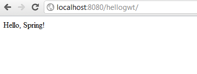

Разрабатываем приложение на Spring и GWT. Часть 1 - Настраиваем Spring
----------------------------------------------------------------------
* `hellogwt - Alex Tretyakov Blog`: [http://alextretyakov.blogspot.com/2011/10/4.html](http://alextretyakov.blogspot.com/2011/10/4.html)
* `hellogwt - Revision 5: /trunk`: [http://hellogwt.googlecode.com/svn/trunk/](http://hellogwt.googlecode.com/svn/trunk/)
> В процессе написания приложения будут использоваться:
>
>- Spring 3.0.5
>- GWT 2.4.0
>- Maven 3.0.3
>- Tomcat 6.0.33 ([http://localhost:8080/hellogwt/](http://localhost:8080/hellogwt/))

